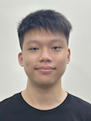
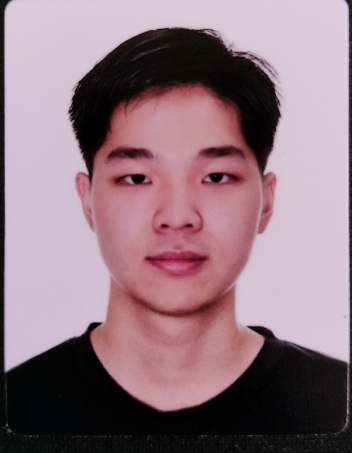
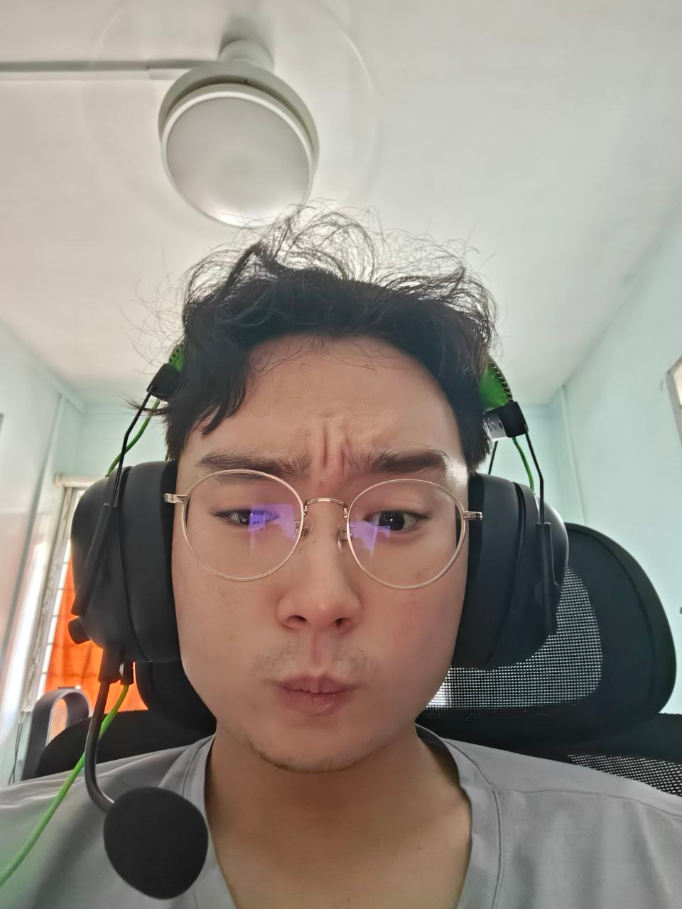
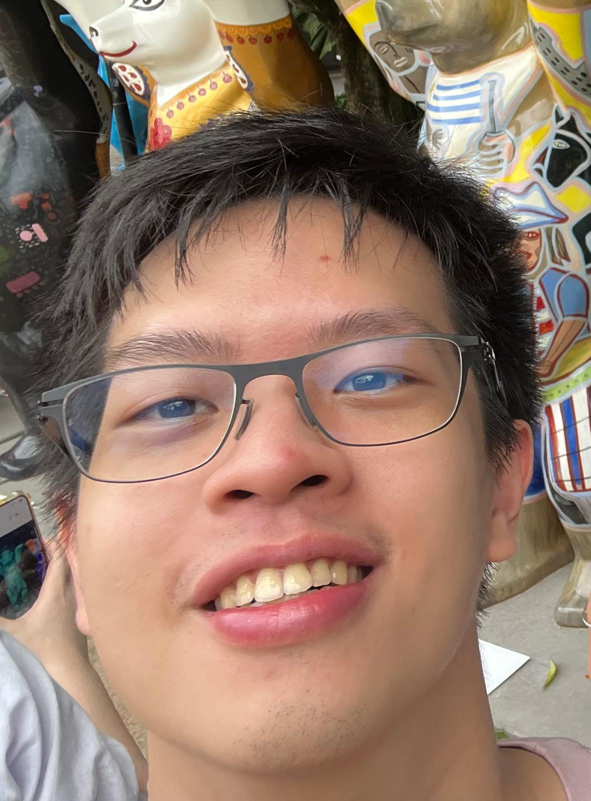

# About Us

We are a team based in the [School of Computing, National University of Singapore](http://www.comp.nus.edu.sg).

You can reach us at the email `seer[at]comp.nus.edu.sg`

## Project team

### Yorick Chew

[[github](https://github.com/yorick-chew)]
[[portfolio](team/yorickchew.md)]

* Role: Developer
* Responsibilities: Documentation

### Jane Doe

[[github](http://github.com/johndoe)]
[[portfolio](team/johndoe.md)]

* Role: Team Lead
* Responsibilities: UI

### Gabriel Tan

[[github](http://github.com/bearkerb)] [[portfolio](team/gabriel-tan.md)]

* Role: Developer
* Responsibilities: Data

### Goo Zheng Xien Sean

[[github](http://github.com/goozxs)]
[[portfolio](team/goozxs.md)]

* Role: Developer
* Responsibilities: Dev Ops + Threading

### Benjamin Lim

[[github](http://github.com/glacialthorn)]
[[portfolio](team/glacialthorn.md)]

* Role: Developer
* Responsibilities: UI
