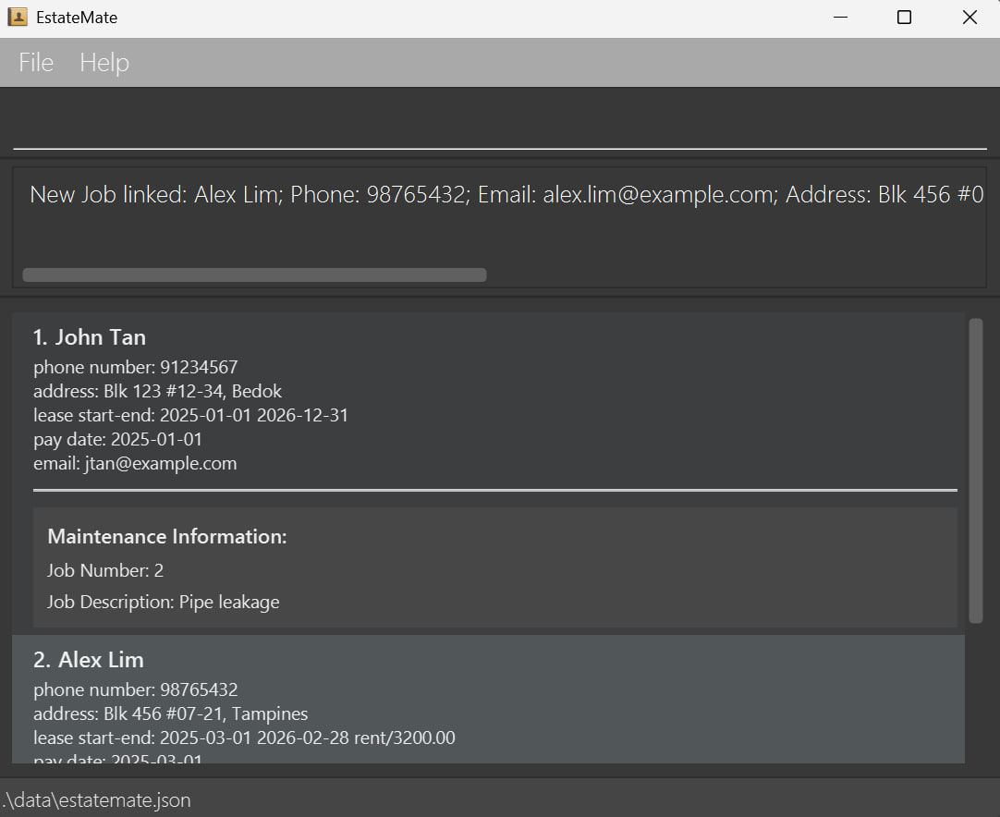

# Welcome to EstateMate User Guide!

EstateMate (EM) is a <strong>desktop application</strong> for managing contacts, 
designed to be <strong>fast and efficient</strong> using keyboard shortcuts, while still offering the convenience of a click-based interface.
If you can type fast, EstateMate can get your contact management tasks done faster than traditional mouse-only apps.

--------------------------------------------------------------------------------------------------------------------

## Table of Contents

[1. Introduction](#1-introduction)
- [1.1 What Is EstateMate](#1-1-what-is-estatemate)
- [1.2 User Proficiency and Expectations](#1-2-user-proficiency-and-expectations)
- [1.3 Why This User Guide Matters](#1-3-why-this-user-guide-matters)

[2. Quick Start](#2-quick-start)
- [2.1 Installation](#2-1-installation)
- [2.2 User Interface Overview](#2-2-user-interface-overview)
- [2.3 Understanding Command Prefix](#2-3-understanding-command-prefix)

[3. Features](#3-features)
- [3.1 Command Summary](#3-1-command-summary)
- [3.2 Features Related To Tenants](#3-2-features-related-to-tenants)
    - [3.2.1 Adding a Tenant](#3-2-1-adding-a-tenant-tenant)
    - [3.2.2 Deleting a Tenant](#3-2-2-deleting-a-tenant-dtenant)
    - [3.2.3 Editing a Tenant](#3-2-3-editing-a-tenant-edit)
    - [3.2.4 Finding a Tenant](#3-2-4-finding-a-tenant-find)
    - [3.2.5 Listing All Tenants](#3-2-5-listing-all-tenants-list)
- [3.3 Features Related To Maintenance Jobs](#3-3-features-related-to-maintenance-jobs)
    - [3.3.1 Adding a Job](#3-3-1-adding-a-job-job)
    - [3.3.2 Deleting a Job](#3-3-2-deleting-a-job-djob)
    - [3.3.3 Editing a Job](#3-3-3-editing-a-job-ejob)
    - [3.3.4 Finding a Job](#3-3-4-finding-a-job-fjob)
    - [3.3.5 Linking Job To Tenant](#3-3-5-linking-job-to-tenant-link)
    - [3.3.6 Listing All Jobs](#3-3-6-listing-all-jobs-ljob)
    - [3.3.7 Marking Job As Completed](#3-3-7-marking-job-as-completed-mark)
    - [3.3.8 Marking Job As Not Completed](#3-3-8-marking-job-as-not-completed-unmark)
- [3.4 General Features](#3-4-general-features)
    - [3.4.1 Clearing All Tenants](#3-4-1-clearing-all-tenants-clear)
    - [3.4.2 Exiting Application](#3-4-2-exiting-application-exit)
    - [3.4.3 Getting Help](#3-4-3-getting-help-help)

[4. FAQ and Known Issues](#4-faq-and-known-issues)
- [4.1 Known Issues](#4-1-known-issues)

[5. Glossary](#5-glossary)

--------------------------------------------------------------------------------------------------------------------

## 1. Introduction

### 1.1 What Is EstateMate

EstateMate is a comprehensive application and management tool designed specifically 
for property managers and its executive firms. 

### 1.2 User Proficiency and Expectations
- ***Professional Focus:*** EstateMate is designed for property managers who need an efficient way to track tenant contacts
  and manage maintenance tasks.
- ***Efficiency:*** Built specifically for the property management workflow, EstateMate prioritizes fast,
  streamlined operations so managers can update tenant information and track maintenance jobs.
- ***User-Friendly:*** Whether you are familiar with command-line tools or prefer a simple graphical interface,
  EstateMate is designed to be intuitive and straightforward, ensuring smooth property management.

### 1.3 Why This User Guide Matters

This guide is designed to help property managers make the most out of EstateMate's features.
Managing tenant contacts and tracking maintenance tasks efficiently is essential for smooth property operations.
Inside, you will find step-by-step instructions, examples, and helpful tips to streamline your workflow so that you can 
keep your properties running smoothly.

--------------------------------------------------------------------------------------------------------------------

## 2. Quick start

### 2.1 Installation

1. Ensure you have Java `17` or above installed in your computer. 
   **Mac users:** Ensure you have the precise JDK version prescribed [here](https://se-education.org/guides/tutorials/javaInstallationMac.html).

2. Download the latest `.jar` file from [here](https://github.com/AY2526S1-CS2103T-F08a-2/tp/releases/tag/v1.3).

3. Copy the file to the folder you want to use as the _home folder_ for your application.

4. Open a command terminal, `cd` into the folder you put the jar file in, and use the `java -jar estatemate.jar` command to run the application. 
   A GUI similar to the below should appear in a few seconds. Note how the app contains some sample data. 
   

5. Type the command in the command box and press Enter to execute it. e.g. typing **`help`** and pressing `Enter` will open the help window. 
   Some example commands you can try:

    * `list` : Lists all contacts.

    * `tenant n/John Tan p/91234567 e/jtan@example.com a/Blk 123 #12-34, Bedok lease/2025-01-01 2026-12-31 r/2800.00 paydate/2025-01-01`:
      Adds a contact named `John Tan` to the application.

    * `dtenant 3` : Deletes the 3rd tenant contact shown in the current list.

    * `clear` : Deletes all contacts.

    * `exit` : Exits the application.

6. Refer to the [Features](#3-features) below for details of each command.

### 2.2 User Interface Overview

- insert UI (coming soon...)

### 2.3 Understanding Command Prefix

In EstateMate, commands use **prefixes** to identify each parameter.  
Each prefix must be followed by a `/` and its corresponding value.

| **Prefix** | **Meaning**     | **Example Usage**             |
|------------|-----------------|-------------------------------|
| `n/`       | Name            | `n/John Tan`                  |
| `p/`       | Phone Number    | `p/91234567`                  |
| `e/`       | Email Address   | `e/jtan@example.com`          |
| `a/`       | Address         | `a/Blk 123 #12-34`            |
| `lease/`   | Lease Start-End | `lease/2025-01-01 2026-12-31` |
| `r/`       | Amount          | `r/2800.00`                   |
| `paydate/` | PayDate         | `paydate/2025-01-01`          |
| `t/`       | Tag             | `t/friend`                    |
| `j/`       | Job Number | `j/2`                          |
| `d/`      | Description  | `d/Broken pipe`        |

💡 *You can combine multiple prefixes in one command, such as:*  
`tenant n/John Tan p/91234567 e/jtan@example.com a/Blk 123 #12-34, 
Bedok lease/2025-01-01 2026-12-31 r/2800.00 paydate/2025-01-01`

--------------------------------------------------------------------------------------------------------------------

## 3. Features

This section provides a comprehensive overview of the features available in **EstateMate**.  
It is designed to help property managers understand how to efficiently manage tenant information and maintenance jobs
through various commands.

Each feature is grouped by functionality:
- **Command Summary** — Quick reference table of all available commands.
- **Tenant Management** — Commands for adding, deleting, editing, and finding tenant details.
- **Maintenance Job Management** — Commands for creating, tracking, and updating maintenance jobs, including linking them to tenants.
- **General Utilities** — Commands for clearing data, exiting the application, and accessing in-app help.

📌**Important Notes about Command Format:** 

<box type="info" seamless>
* Words in `UPPER_CASE` are the parameters to be supplied by the user. 
  e.g. in `add n/NAME`, `NAME` is a parameter which can be used as `add n/John Doe`.

* Items in square brackets are optional. 
  e.g `n/NAME [t/TAG]` can be used as `n/John Doe t/friend` or as `n/John Doe`.

* Items with `…`​ after them can be used multiple times including zero times. 
  e.g. `[t/TAG]…​` can be used as ` ` (i.e. 0 times), `t/friend`, `t/friend t/family` etc.

* Parameters can be in any order. 
  e.g. if the command specifies `n/NAME p/PHONE_NUMBER`, `p/PHONE_NUMBER n/NAME` is also acceptable.

* Extraneous parameters for commands that do not take in parameters (such as `help`, `list`, `exit` and `clear`) will be ignored. 
  e.g. if the command specifies `help 123`, it will be interpreted as `help`.

* If you are using a PDF version of this document, be careful when copying and pasting commands that span multiple lines as space characters surrounding line-breaks may be omitted when copied over to the application.
  </box>

### 3.1 Command Summary

Action                      | Format, Examples
----------------------------|------------------
**Add Tenant**              | `tenant n/NAME p/PHONE e/EMAIL a/ADDRESS lease/START END r/AMOUNT paydate/PAYDATE`  e.g., `tenant n/John Tan p/91234567 e/jtan@example.com a/Blk 123 #12-34, Bedok lease/2025-01-01 2026-12-31 r/2800.00 paydate/2025-01-01`
**Add Job**                 | `job d/DESCRIPTION`  e.g., `job d/Water leakage in ceiling`
**Clear**                   | `clear`
**Delete Tenant**           | `dtenant TENANT_INDEX`  e.g., `dtenant 3`
**Delete Job**              | `djob JOB_NUMBER`  e.g., `djob 3`
**Edit Tenant**             | `edit TENANT_INDEX [n/NAME] [p/PHONE_NUMBER] [e/EMAIL] [a/ADDRESS]`  e.g.,`edit 2 n/James Lee e/jameslee@example.com`
**Edit Job**                | `ejob JOB_NUMBER d/DESCRIPTION`  e.g.,`ejob 3 d/fix faucet`
**Exit**                    | `exit`
**Find Tenant**             | `find KEYWORD [MORE_KEYWORDS]`  e.g., `find James Jake`
**Find Job**                | `fjob KEYWORD [MORE_KEYWORDS]`  e.g., `fjob electrical plumbing renovation`
**Help**                    | `help`
**Link Job to Tenant**      | `link TENANT_INDEX j/JOB_NUMBER`  e.g., `link 1 j/2`
**List Tenants**             | `list`
**List Jobs**                | `ljob`
**Mark Job**                | `mark JOB_NUMBER`  e.g., `mark 1`
**Unmark Job**              | `unmark JOB_NUMBER`  e.g., `unmark 1`

### 3.2 Features Related To Tenants

#### 3.2.1 Adding a Tenant: `tenant`
Adds a tenant to the application.

Format: `tenant n/NAME p/PHONE e/EMAIL a/ADDRESS lease/START END r/AMOUNT paydate/PAYDATE [t/TAG]…​`

<box type="Note" seamless>

💡**Note:** A tenant can have any number of tags or requests (including 0).
</box>

Examples:
* `tenant n/John Tan p/91234567 e/jtan@example.com a/Blk 123 #12-34, Bedok lease/2025-01-01 2026-12-31 r/2800.00 paydate/2025-01-01`
* `tenant n/Sarah Kim p/12398653 e/sarahk@example.com a/Blk 234 #56-78, Clementi lease/2025-02-02 2027-02-02 r/4000.00 paydate/2025-02-02`

#### 3.2.2 Deleting a Tenant: `dtenant`
Deletes the specified tenant from the application.

Format: `dtenant TENANT_INDEX`

<box type="Note" seamless>

💡**Note:** Index refers to the number shown when tenant list is displayed, and it must be a ***positive whole number***.  
</box>

<box type="warning" seamless>

**⚠️ Warning:** 
- This action is irreversible, data will be ***permanently deleted***.
- Once a tenant is deleted, any links to jobs associated with that tenant will also be removed.
</box>

Examples:
* `list` followed by `dtenant 2` deletes the second tenant listed in the application.
* `find John` followed by `dtenant 1` deletes the 1st person in the results of the `find` command.

#### 3.2.3 Editing a Tenant : `edit`

Edits an existing tenant in the application.

Format: `edit TENANT_INDEX [n/NAME] [p/PHONE] [e/EMAIL] [a/ADDRESS] [lease/LEASE] [r/AMOUNT] [paydate/PAYDATE] [t/TAG]...[j/JOB]...[t/TAG]…​`

<box type="Note" seamless>

💡**Note:**
> * Edits the person at the specified `TENANT_INDEX`. The tenant index refers to the index number shown in the displayed tenant list. The index **must be a positive whole number** 1, 2, 3, …​
> * At least one of the optional fields must be provided.
> * Existing values will be updated to the input values.
> * When editing tags, the existing tags of the person will be removed i.e adding of tags is not cumulative.
> * You can remove all the person’s tags by typing `t/` without
    specifying any tags after it.

</box>

Examples:
*  `edit 1 p/91234567 e/johndoe@example.com` edits the phone number and email address of the 1st person to be `91234567` and `johndoe@example.com` respectively.
*  `edit 2 n/Betsy Crower t/` edits the name of the 2nd person to be `Betsy Crower` and clears all existing tags.

#### 3.2.4 Finding a Tenant: `find`

Find tenants whose names contain any of the given keywords.

Format: `find KEYWORD [MORE_KEYWORDS]`

<box type="Note" seamless>

💡**Note:**
> * The search is case-insensitive. e.g `hans` will match `Hans`
> * The order of the keywords does not matter. e.g. `Hans Bo` will match `Bo Hans`
> * Only the name is searched.
> * Only full words will be matched e.g. `Han` will not match `Hans`
> * Persons matching at least one keyword will be returned (i.e. `OR` search).
    e.g. `Hans Bo` will return `Hans Gruber`, `Bo Yang`

</box>

Examples:
* `find John` returns `john` and `John Doe`.
* `find alex david` returns `Alex Yeoh`, `David Li`. 

#### 3.2.5 Listing All Tenants: `list`
Displays a list of all tenants currently stored in the application, ordered from the earliest added to the most recent.

Format: `list`
<box type="Note" seamless>

💡**Note:**
> - Any additional text after `list` command will be ignored.
> - `list` without any tenants will show you empty list, hence recommend you to add some tenants to the application.

</box>

### 3.3 Features Related to Maintenance Jobs

#### 3.3.1 Adding a Job: `job`
Adds a maintenance job to the job list in the application.

Format: `job d/DESCRIPTION`
<box type="Note" seamless>

💡**Note:**
> - Replace <code>DESCRIPTION</code> with a clear description of the maintenance issue.
> - Each job added will be tracked in the system and can be linked to the respective tenant/unit.

</box>

Examples:
* `job d/Water leakage in ceiling`
* `job d/Pipe leakage`

#### 3.3.2 Deleting a Job: `djob`
Deletes a maintenance job from the application.

Format: `djob JOB_NUMBER`
<box type="Note" seamless>

💡**Note:**
> - Job number refers to the number shown when job list is displayed, and it must be a ***positive whole number***.

</box>

<box type="warning" seamless>

**⚠️ Warning:** 
- This action is irreversible, job will be ***permanently deleted***. 
- Once a job is deleted, any links to tenants associated with that job will also be removed, and it will no longer appear in the tenant’s job list.

</box>

Examples:
* `djob 2` deletes the job with job number 2 if it exists.

#### 3.3.3 Editing a Job: `ejob`
Edits a maintenance job from the application.

Format: `ejob JOB_NUMBER d/DESCRIPTION`
<box type="Note" seamless>

💡**Note:**
> - Job number refers to the number shown when job list is displayed, and it must be a ***positive whole number***.
> - Replace <code>DESCRIPTION</code> with a clear description of the maintenance issue.

</box>

Examples:
* `ejob 3 d/fix faucet` changes the description of the job with job number 3 to "fix faucet".

#### 3.3.4 Finding a Job: `fjob`
Find maintenance jobs whose descriptions contain any of the given keyword.

Format: `fjob KEYWORD [MORE KEYWORDS]`

<box type="Note" seamless>

💡**Note:**
> * The search is case-insensitive. e.g `pipe` will match `Pipe`
> * The order of the keywords does not matter. e.g. `Pipe leak` will match `leak pipe`
> * Only the description is searched.
> * Only full words will be matched e.g. `Pipe` will not match `Pipes`
> * Maintenance jobs matching at least one keyword will be returned (i.e. `OR` search).
    e.g. `Broken window` will return `Broken pipe`, `Window repair`

</box> 

Examples:
- `fjob pipe` returns `pipe` and `Pipe Leakage`.
- `fjob aircon repair` returns `Aircon Leakage` and `Repair Pipe`.

#### 3.3.5 Linking Job to Tenant: `link`
Link a maintenance job to a specific tenant

Format: `link TENANT_INDEX j/JOB_NUMBER`

<box type="Note" seamless>

💡**Note:**
> * `JOB_NUMBER` is the index number of the job in the job list that you want to mark as completed.
> * You can only link jobs and tenants that already exist in the system.
> * Once linked, the job will appear under the tenant’s assigned jobs in the display.
> * Deleting a linked job will also remove it from the tenant’s assigned job list.
> * Marking and unmarking linked job will change the status of completion under tenant's assigned job list.

</box> 

Examples:
- `link 2 j/5` links the 5th maintenance job in the job list to the 2nd tenant in the tenant list.

#### 3.3.6 Listing All Jobs: `ljob`
Displays a list of all jobs currently stored in the application, ordered from the earliest added to the most recent.

Format: `ljob`

<box type="Note" seamless>

💡**Note:**
> - Any additional text after `ljob` command will be ignored.
> - `list` without any jobs will show you empty list, hence recommend you to add some maintenance jobs to the application.
    
</box>

#### 3.3.7 Marking Job as Completed: `mark`
Updates the status of a maintenance job so that completed tasks can be tracked easily.

Format: `mark JOB_NUMBER`

<box type="Note" seamless>

💡**Note:**
> * `JOB_NUMBER` is the index number of the job in the job list that you want to mark as completed.
> * Once marked, the job status will be updated in the display under any linked tenant.
> * If a job is marked by mistake, you can use the `unmark` command to revert it as not completed.

</box> 

Examples:
- `mark 3` updates the completion status of job number 3 of the job list to completed.

#### 3.3.8 Marking Job as Not Completed: `unmark`
Revert a maintenance job's status to not completed in case it was marked as complete by mistake.

Format: `unmark JOB_NUMBER`

<box type="Note" seamless>

💡**Note:**
> * `JOB_NUMBER` is the index number of the job in the job list that you want to mark as completed.
> * Once unmarked, the job will no longer appear as completed under any linked tenant.

</box> 

Examples:
- `unmark 3` updates the status of job number 3 of the job list back to not completed.

### 3.4 General Features

#### 3.4.1 Clearing All Tenants: `clear`
Remove all tenants from the application.

Format: `clear`

<box type="warning" seamless>

**⚠️ Warning:** This action is irreversible, all data will be ***permanently deleted***. Make sure you have backed up any important tenant or job information before using this command.

</box>

#### 3.4.2 Exiting Application: `exit`
Closes the program/application.

Format: `exit`

<box type="Note" seamless>

💡**Note:** All data entered will be automatically saved to storage.
</box>

#### 3.4.3 Getting Help: `help`
Opens the help window which provides link accessing the user guide and get assistance with commands. This command is useful if you need a quick reminder on how to use the available commands.

Format: `help`

## 4. FAQ and Known Issues

**Q**: How do I transfer my data to another Computer? 
**A**: Install the app in the other computer and overwrite the empty data file it creates with the file that contains the data of your previous EstateMate home folder.

### 4.1 Known issues

1. **When using multiple screens**, if you move the application to a secondary screen, and later switch to using only the primary screen, the GUI will open off-screen. The remedy is to delete the `preferences.json` file created by the application before running the application again.
2. **If you minimize the Help Window** and then run the `help` command (or use the `Help` menu, or the keyboard shortcut `F1`) again, the original Help Window will remain minimized, and no new Help Window will appear. The remedy is to manually restore the minimized Help Window.

--------------------------------------------------------------------------------------------------------------------

## 5. Glossary

Terms               | Meanings
---------------------|------------------
Command Prefix       | A short identifier followed by a `/` used in commands to specify parameters
Optional Parameter   | A parameter enclosed in square brackets `[ ]` in a command that can be included or omitted.
Upper-Case Parameter | A placeholder in commands (e.g., `NAME`, `PHONE`) that must be replaced with actual values.

</box>
