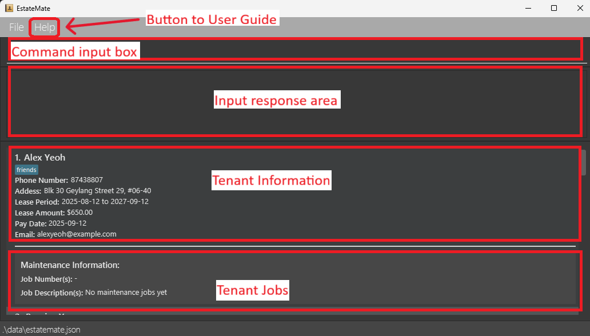
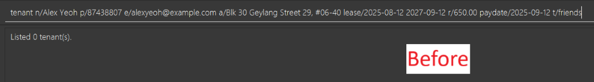
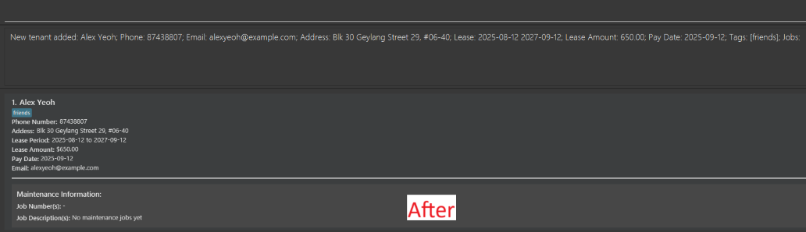
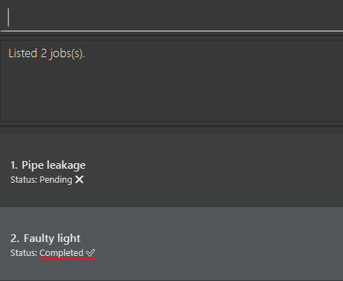

# Welcome to EstateMate User Guide!

--------------------------------------------------------------------------------------------------------------------

## Table of Contents

[1. Introduction](#1-introduction)
- [1.1 What Is EstateMate](#1-1-what-is-estatemate)
- [1.2 User Proficiency and Expectations](#1-2-user-proficiency-and-expectations)
- [1.3 Why This User Guide Matters](#1-3-why-this-user-guide-matters)

[2. Quick Start](#2-quick-start)
- [2.1 Installation](#2-1-installation)
- [2.2 User Interface Overview](#2-2-user-interface-overview)
- [2.3 Understanding Command Prefix](#2-3-understanding-command-prefix)

[3. Features](#3-features)
- [3.1 Tenant Management](#3-1-tenant-management)
    - [3.1.1 Adding a Tenant](#3-1-1-adding-a-tenant-tenant)
    - [3.1.2 Deleting a Tenant](#3-1-2-deleting-a-tenant-delete)
    - [3.1.3 Editing a Tenant](#3-1-3-editing-a-tenant-edit)
    - [3.1.4 Finding a Tenant](#3-1-4-finding-a-tenant-find)
    - [3.1.5 Listing All Tenants](#3-1-5-listing-all-tenants-list)
- [3.2 Maintenance Job Management](#3-2-maintenance-job-management)
    - [3.2.1 Adding a Job](#3-2-1-adding-a-job-job)
    - [3.2.2 Deleting a Job](#3-2-2-deleting-a-job-djob)
    - [3.2.3 Editing a Job](#3-2-3-editing-a-job-ejob)
    - [3.2.4 Finding a Job](#3-2-4-finding-a-job-fjob)
    - [3.2.5 Linking Job To Tenant](#3-2-5-linking-job-to-tenant-link)
    - [3.2.6 Listing All Jobs](#3-2-6-listing-all-jobs-ljob)
    - [3.2.7 Marking Job As Completed](#3-2-7-marking-job-as-completed-mark)
    - [3.2.8 Marking Job As Not Completed](#3-2-8-marking-job-as-not-completed-unmark)
- [3.3 General Utilities](#3-3-general-features)
    - [3.3.1 Clearing All Tenants](#3-3-1-clearing-all-tenants-clear)
    - [3.3.2 Exiting Application](#3-3-2-exiting-application-exit)
    - [3.3.3 Getting Help](#3-3-3-getting-help-help)

[4. Command Summary](#4-command-summary)

[5. FAQ and Known Issues](#5-faq-and-known-issues)
- [5.1 FAQ](#5-1-faq)
- [5.2 Known Issues](#5-2-known-issues)

[6. Glossary](#6-glossary)

--------------------------------------------------------------------------------------------------------------------

## 1. Introduction
 

### 1.1 What Is EstateMate

EstateMate is designed for property managers who need an efficient way to 
track tenant information and manage maintenance jobs.

 

### 1.2 User Proficiency and Expectations
- ***Professional Focus:*** EstateMate is optimized for property managers who manage multiple tenants and maintenance jobs at once
  and need a reliable place to keep things organised.
- ***Efficiency:*** Built specifically for the property management workflow, EstateMate prioritizes fast,
  streamlined operations so managers can update tenant information and track maintenance jobs.
- ***User-Friendly:*** Whether you are familiar with [command-line tools](#cli) or prefer a simple [graphical interface](#gui),
  EstateMate is designed to be intuitive and straightforward, ensuring smooth property management.

 

### 1.3 Why This User Guide Matters

This guide is designed to help property managers make the most out of EstateMate's features.
Managing tenant contacts and tracking maintenance tasks efficiently is essential for smooth property operations.
Inside, you will find step-by-step instructions, examples, and helpful tips to streamline your workflow so that you can 
keep your properties running smoothly.

--------------------------------------------------------------------------------------------------------------------

## 2. Quick start
 

### 2.1 Installation

1. Ensure you have [Java](#java) `17` or above installed in your computer (Follow the guide [here](https://se-education.org/guides/tutorials/javaInstallation.html)).  
   **Mac users:** Ensure you have the precise JDK version prescribed [here](https://se-education.org/guides/tutorials/javaInstallationMac.html).

2. Download the latest [`.jar` file](#jar-file) from [here](https://github.com/AY2526S1-CS2103T-F08a-2/tp/releases/latest).

3. Copy the file to the folder you want to use as the [_home folder_](#home-folder). This is the folder where you would like to keep the [`.jar` file](#jar-file) for access, and where the app will store its data files.

4. Open your search bar by pressing the Windows key (or the search button for Mac).

5. Open a command [terminal](#terminal) by typing "terminal" in the search bar and press "Enter". The command terminal is an app that is already in your computer.

6. Use `cd [folder path]` to navigate into the folder you put the jar file in, and use the `java -jar estatemate.jar` command to run the application. 
   A [GUI (Graphical User Interface)](#gui) similar to the below should appear in a few seconds. Note how the app contains some sample data. 
   

7. Type a [command](#command) in the command box and press Enter to execute it. e.g. typing **`help`** and pressing `Enter` will open the help window. 
   Some example commands you can try:

    * `list` : Lists all contacts.

    * `tenant n/John Tan p/91234567 e/jtan@example.com a/Blk 123 #12-34, Bedok lease/2025-01-01 2026-12-31 r/2800.00 paydate/2025-01-01`:
      Adds a contact named `John Tan` to the application.

    * `delete 3` : Deletes the 3rd tenant contact shown in the current list.

    * `clear` : Deletes all contacts.

    * `exit` : Exits the application. 

  

8. Refer to the [Features](#3-features) below for details of each command.

 

### 2.2 User Interface Overview

Upon opening the application, you should see the following UI:

To input [commands](#command), use the input box at the top of the window.
The available commands will be explained below.

 

### 2.3 Understanding Command Prefix

In EstateMate, [commands](#command) use [**prefixes**](#prefix) to identify each [parameter](#parameter).  
Each prefix must be followed by a `/` and its corresponding value.

| **Prefix** | **Meaning**     | **Example Usage**             |
|------------|-----------------|-------------------------------|
| `n/`       | Name            | `n/John Tan`                  |
| `p/`       | Phone Number    | `p/91234567`                  |
| `e/`       | Email Address   | `e/jtan@example.com`          |
| `a/`       | Address         | `a/Blk 123 #12-34`            |
| `lease/`   | Lease Start-End | `lease/2025-01-01 2026-12-31` |
| `r/`       | Amount          | `r/2800.00`                   |
| `paydate/` | PayDate         | `paydate/2025-01-01`          |
| `t/`       | Tag             | `t/friend`                    |
| `j/`       | Job Number | `j/2`                          |
| `d/`      | Description  | `d/Broken pipe`        |

💡**Tip:** 
Combine multiple prefixes in one command: 
`tenant n/John Tan p/91234567 e/jtan@example.com a/Blk 123 #12-34, Bedok lease/2025-01-01 2026-12-31 r/2800.00 paydate/2025-01-01`

--------------------------------------------------------------------------------------------------------------------

## 3. Features

This section provides a comprehensive overview of the features available in **EstateMate**.  
It is designed to help property managers understand how to efficiently manage tenant information and maintenance jobs
through various [commands](#command).

Each feature is grouped by functionality:
- **Tenant Management** — Commands for adding, deleting, editing, and finding tenant details.
- **Maintenance Job Management** — Commands for creating, tracking, and updating maintenance jobs, including linking them to tenants.
- **General Utilities** — Commands for clearing data, exiting the application, and accessing in-app help.

⚠️ <strong>Important Notes about Command Format:</strong>  

* Words in `UPPER_CASE` are the [parameters](#parameter) to be supplied by the user. 
  e.g. in `tenant n/NAME`, `NAME` is a parameter which can be used as `tenant n/John Doe`.

* Items in square brackets are optional. 
  e.g. `n/NAME [t/TAG]` can be used as `n/John Doe t/friend` or as `n/John Doe`.

* Items with `…`​ after them can be used multiple times including zero times. 
  e.g. `[t/TAG]…​` can be used as ` ` (i.e. 0 times), `t/friend`, or `t/friend t/family` etc.

* Parameters can be in any order. 
  e.g. if the command specifies `n/NAME p/PHONE_NUMBER`, `p/PHONE_NUMBER n/NAME` is also acceptable.

* Extraneous parameters for commands that do not take in parameters (such as `help`, `list`, `exit` and `clear`) will be ignored. 
  e.g. if the command specifies `help 123`, it will be interpreted as `help`.

* If you are using a PDF version of this document, be careful when copying and pasting commands that span multiple lines as space characters surrounding line-breaks may be omitted when copied over to the application.

  

### 3.1 Tenant Management 
 

#### 3.1.1 Adding a Tenant: `tenant`
Adds a tenant to the application.

Format: `tenant n/NAME p/PHONE e/EMAIL a/ADDRESS lease/START END r/AMOUNT paydate/PAYDATE [t/TAG]…​`

📌**Note:** 
- A tenant can have any number of tags, including zero.
- Address can only take up to 500 characters including spaces, symbols and punctuations.
- `lease/START END` refers to the lease period, specified as two valid calendar dates in the format `yyyy-MM-dd yyyy-MM-dd`, separated by exactly one space. The first date is the start date and the second date is the end date. The end date must be on the same day or after the start date.

Examples:
- `tenant n/John Tan p/91234567 e/jtan@example.com a/Blk 123 #12-34, Bedok lease/2025-01-01 2026-12-31 r/2800.00 paydate/2025-01-01`
- `tenant n/Sarah Kim p/12398653 e/sarahk@example.com a/Blk 234 #56-78, Clementi lease/2025-02-02 2027-02-02 r/4000.00 paydate/2025-02-02`

  
    
  

 

#### 3.1.2 Deleting a Tenant: `delete`
Deletes the specified tenant from the application.

Format: `delete TENANT_NUMBER`

📌**Note:** 
- `TENANT_NUMBER` is the index displayed next to each tenant in the tenant list, and must be a ***positive number*** between 1 and 2147483647.
- Only tenants that exist in the ***latest displayed*** tenant list (most recent use of [`list`](#3-1-5-listing-all-tenants-list) or [`find`](#3-1-4-finding-a-tenant-find) commands) can be deleted. 

<strong>❗ Warning:</strong> 
- This action is irreversible, data will be ***permanently deleted***. 
- Once a tenant is deleted, any links to jobs associated with that tenant will also be removed.

 

Examples:
- `list` followed by `delete 2` deletes the 2nd tenant listed in the application.
- `find John` followed by `delete 1` deletes the 1st tenant in the results of the `find` command.

💡**Tip:**
- Use [`list`](#3-1-5-listing-all-tenants-list) or [`find`](#3-1-4-finding-a-tenant-find) first to confirm the correct tenant before deleting to avoid accidental removal.
- If you are deleting multiple tenants, consider double-checking indices after each deletion, as the list order updates dynamically.
 

#### 3.1.3 Editing a Tenant: `edit`

Edits an existing tenant in the application.

Format: `edit TENANT_NUMBER [n/NAME] [p/PHONE] [e/EMAIL] [a/ADDRESS] [lease/START END] [r/AMOUNT] [paydate/PAYDATE] [t/TAG]…​`

📌**Note:**
- `TENANT_NUMBER` is the index displayed next to each tenant in the tenant list, and must be a ***positive number*** between 1 and 2147483647.
- Provide ***at least one*** parameter to edit.
- Tags are replaced, not added cumulatively; t/ clears all tags.
- You can remove all the person’s tags by typing `t/` without
   specifying any tags after it.

Examples:
- `edit 1 p/91234567 e/johndoe@example.com` edits the phone number and email address of the 1st tenant to be `91234567` and `johndoe@example.com` respectively.
- `edit 2 n/Betsy Crower t/` edits the name of the 2nd tenant to be `Betsy Crower` and clears all existing tags. 

💡**Tip:**
- Use [`list`](#3-1-5-listing-all-tenants-list) or [`find`](#3-1-4-finding-a-tenant-find) first to confirm the correct tenant before editing to avoid overwriting important data. 
- When updating multiple parameters, include all changes in a single command to reduce errors.
 

#### 3.1.4 Finding a Tenant: `find`

Finds tenants whose names contain any of the given [keywords](#keyword).

Format: `find KEYWORD [MORE_KEYWORDS]`

📌**Note:**
- The search is case-insensitive. e.g `hans` will match `Hans`
- The order of the keywords does not matter. e.g. `Hans Bo` will match `Bo Hans`
- Only the names of tenants are searched.
- Only full words will be matched e.g. `Han` will not match `Hans`
- Tenants matching at least one keyword will be returned.
    e.g. `Hans Bo` will return `Hans Gruber`, `Bo Yang`

Examples:
- `find John` returns `john` and `John Doe`.
- `find alex david` returns `Alex Yeoh`, `David Li`. 

💡**Tip:**
- Use specific keywords to narrow results, especially for common names.
- Combine multiple keywords when you want to search for multiple tenants at once.
 

#### 3.1.5 Listing All Tenants: `list`
Displays a list of all tenants currently stored in the application, ordered from the earliest added to the most recent.

Format: `list`

📌**Note:**
- Any additional input after `list` command will be ignored.
- `list` without any tenants will show you an empty list, hence you are recommended to add some tenants to the application before using this command.
  

### 3.2 Maintenance Job Management 
 

#### 3.2.1 Adding a Job: `job`
Adds a maintenance job to the application.

Format: `job d/DESCRIPTION`

📌**Note:**
- Provide a ***clear and concise*** description of the maintenance issue.
- Jobs can later be linked to tenants for easy tracking.
- Adding multiple jobs with the same description is allowed. This is useful when different units report the similar issues.

Examples:
- `job d/Water leakage in ceiling`
- `job d/Pipe leakage` 

💡**Tip:**
- Use consistent wording for similar issues (e.g., "Pipe leakage" vs "Leaking pipe") to make [finding](#3-2-4-finding-a-job-fjob) the job easier later on.
- Add jobs as soon as issues are reported to keep tenant records up-to-date.
 

#### 3.2.2 Deleting a Job: `djob`
Deletes a maintenance job from the application.

Format: `djob JOB_NUMBER`

📌**Note:**
- `JOB_NUMBER` is the index displayed next to each job in the job list, and must be a ***positive number*** between 1 and 2147483647.
- `JOB_NUMBER` is a unique number tied to each job, and will not be affected by the use of 
[`ljob`](#3-2-6-listing-all-jobs-ljob) and [`fjob`](#3-2-4-finding-a-job-fjob), unlike the `TENANT_NUMBER` of the [`delete`](#3-1-2-deleting-a-tenant-delete) command.
- Deleting a job removes it from all tenants’ assigned job lists.

<strong>❗ Warning:</strong> 
- This action is irreversible, the job will be ***permanently deleted***. 
- Once a job is deleted, any links to tenants associated with that job will also be removed, and it will no longer appear in the tenant’s job list.

 

Examples:
* `djob 2` deletes the job with job number 2 if it exists.

💡**Tip:**
- Use [`ljob`](#3-2-6-listing-all-jobs-ljob) to double-check the job number before deleting to avoid removing the wrong job.
- If you may need a record of the job later, consider [marking it as completed](#3-2-7-marking-job-as-completed-mark) instead of deleting it.

#### 3.2.3 Editing a Job: `ejob`
Edits a maintenance job in the application.

Format: `ejob JOB_NUMBER d/DESCRIPTION`

📌**Note:**
- `JOB_NUMBER` is the index displayed next to each job in the job list, and must be a ***positive number*** between 1 and 2147483647.
- Only jobs that exist in the current displayed list can be edited.
- Provide a ***clear and concise*** description of the maintenance issue.
- Editing a job to match the description of another job is allowed. This is useful when different units report the similar issues.

Examples:
* `ejob 3 d/fix faucet` changes the description of the job with job number 3 to "fix faucet".

💡**Tip:**
- Use descriptive keywords in the description to make [finding](#3-2-4-finding-a-job-fjob) the job easier later on.
- You can quickly edit a job after using [`ljob`](#3-2-6-listing-all-jobs-ljob) to confirm the job number.

#### 3.2.4 Finding a Job: `fjob`
Finds maintenance jobs whose descriptions contain any of the given [keywords](#keyword).

Format: `fjob KEYWORD [MORE KEYWORDS]`

📌**Note:**
- The search is case-insensitive. e.g `pipe` will match `Pipe`
- The order of the keywords does not matter. e.g. `Pipe leak` will match `leak pipe`
- Only the description is searched.
- Only full words will be matched e.g. `Pipe` will not match `Pipes`
- Maintenance jobs matching at least one keyword will be returned.
   e.g. `Broken window` will return `Broken pipe`, `Window repair`

Examples:
- `fjob pipe` returns `pipe` and `Pipe Leakage`.
- `fjob aircon repair` returns `Aircon Leakage` and `Repair Pipe`.

💡**Tip:**
- Use specific keywords related to the job description to narrow down results, e.g., `pipe leakage` instead of just `pipe`.
- Combine multiple keywords for broader search if you’re unsure of the exact description, e.g., `aircon repair ceiling`.

#### 3.2.5 Linking Job to Tenant: `link`
Links a maintenance job to a specific tenant so that the job can be tracked alongside its relevant tenants.

Format: `link TENANT_NUMBER j/JOB_NUMBER`

📌**Note:**
- `JOB_NUMBER` is the index displayed next to each job in the job list.
- You can only link jobs and tenants that already exist in the system.
- Once linked, the job will appear under the tenant’s assigned jobs in the display.
- Deleting a linked job will also remove it from the all tenants' assigned job lists.
- Marking and unmarking linked job will change the status of completion under tenant's assigned job list.
- The same job can be linked to multiple tenants.

Examples:
- `link 1 j/2` links the 2nd maintenance job in the job list to the 1st tenant in the tenant list. 
 

  
 

💡**Tip:**
- Link jobs as soon as they are created to keep tenants’ maintenance records accurate and avoid losing track of pending tasks.
- Link the same job to multiple tenants if they all face the same issue (e.g. The same pest infestation affecting multiple units).

#### 3.2.6 Listing All Jobs: `ljob`
Displays a list of all jobs currently stored in the application, ordered from the earliest added to the most recent.

Format: `ljob`

📌**Note:**
- Any additional input after `ljob` command will be ignored.
- Running the `ljob` command without any jobs stored in the application will show you an empty list, hence you are recommended to add some maintenance jobs before using this command.

#### 3.2.7 Marking Job as Completed: `mark`
Updates the status of a maintenance job to `Completed` so that you can track completed maintenance jobs easily.

Format: `mark JOB_NUMBER`

📌**Note:**
- `JOB_NUMBER` is the index displayed next to each job in the job list, and must be a ***positive number*** between 1 and 2147483647.
- Once marked, the job status will be updated in the display under any linked tenant.
- If a job is marked by mistake, you can use the [`unmark`](#3-2-8-marking-job-as-not-completed-unmark) command to revert it to `Not Completed`.
- `mark` will complete the job for all tenants linked to the job.

Examples:
- `mark 2` updates the completion status of job number 2 of the job list to 'completed'.

  
  

 

💡**Tip:**
- Use [`ljob`](#3-2-6-listing-all-jobs-ljob) to double-check the job list before using `mark` to ensure you’re updating the correct job.
- Use [`unmark`](#3-2-8-marking-job-as-not-completed-unmark) to revert mistakes if a job is accidentally marked as not completed.

#### 3.2.8 Marking Job as Not Completed: `unmark`
Reverts a maintenance job's status to `Not Completed` in case it was marked as complete by mistake.

Format: `unmark JOB_NUMBER`

📌**Note:**
- `JOB_NUMBER` is the index displayed next to each job in the job list, and must be a ***positive number*** between 1 and 2147483647.
- Once unmarked, the job will no longer appear as completed.
- `unmark` will mark the job as not complete for all tenants linked to the job.

Examples:
- `unmark 3` updates the status of job number 3 in the job list back to not completed.

💡**Tip:** 
- Use [`ljob`](#3-2-6-listing-all-jobs-ljob) to double-check the job list before using `unmark` to ensure you’re updating the correct job.
- Use [`mark`](#3-2-7-marking-job-as-completed-mark) to revert mistakes if you accidentally `unmark` a job.

 

### 3.3 General Utilities 
 

#### 3.3.1 Clearing All Tenants: `clear`
Removes **ALL** tenants from the application.

Format: `clear`

<strong>❗ Warning:</strong> 
This action is irreversible, all data will be ***permanently deleted***. Make sure you have backed up any important tenant or job information before using this command.

 

💡**Tip:** Use `clear` only when you want to start fresh or reset your tenant list.
 

#### 3.3.2 Exiting Application: `exit`
Closes the program.

Format: `exit`

📌**Note:** All data entered will be automatically saved to storage.
 

#### 3.3.3 Getting Help: `help`
Opens the help window which provides a link for accessing the user guide to get assistance with commands. This command is useful if you need a quick reminder on how to use the available commands.

Format: `help`

--------------------------------------------------------------------------------------------------------------------

## 4. Command Summary
 

Action                      | Format                                                                             |  Examples
----------------------------|------------------------------------------------------------------------------------|--------------------------------------------------
[**Add Tenant**](#3-1-1-adding-a-tenant-tenant)             | `tenant n/NAME p/PHONE e/EMAIL a/ADDRESS lease/START END r/AMOUNT paydate/PAYDATE` | `tenant n/John Tan p/91234567 e/jtan@example.com a/Blk 123 #12-34, Bedok lease/2025-01-01 2026-12-31 r/2800.00 paydate/2025-01-01`
[**Add Job**](#3-2-1-adding-a-job-job)                      | `job d/DESCRIPTION`                                                                | `job d/Water leakage in ceiling`                                                           
[**Clear**](#3-3-1-clearing-all-tenants-clear)              | `clear`                                                                            |
[**Delete Tenant**](#3-1-2-deleting-a-tenant-delete)       | `delete TENANT_NUMBER`                                                             | `delete 3`                                                                             
[**Delete Job**](#3-2-2-deleting-a-job-djob)                | `djob JOB_NUMBER`                                                                  | `djob 3`                                                                                     
[**Edit Tenant**](#3-1-3-editing-a-tenant-edit)             | `edit TENANT_NUMBER [n/NAME] [p/PHONE_NUMBER] [e/EMAIL] [a/ADDRESS]`               | `edit 2 n/James Lee e/jameslee@example.com` 
[**Edit Job**](#3-2-3-editing-a-job-ejob)                   | `ejob JOB_NUMBER d/DESCRIPTION`                                                    | `ejob 3 d/fix faucet`                     
[**Exit**](#3-3-2-exiting-application-exit)                 | `exit`                                                                             |
[**Find Tenant**](#3-1-4-finding-a-tenant-find)             | `find KEYWORD [MORE_KEYWORDS]`                                                     | `find James Jake`                         
[**Find Job**](#3-2-4-finding-a-job-fjob)                   | `fjob KEYWORD [MORE_KEYWORDS]`                                                     | `fjob electrical plumbing renovation`     
[**Help**](#3-3-3-getting-help-help)                        | `help`                                                                             |
[**Link Job to Tenant**](#3-2-5-linking-job-to-tenant-link) | `link TENANT_NUMBER j/JOB_NUMBER`                                                  | `link 1 j/2`                            
[**List Tenants**](#3-1-5-listing-all-tenants-list)         | `list`                                                                             | 
[**List Jobs**](#3-2-6-listing-all-jobs-ljob)               | `ljob`                                                                             | 
[**Mark Job**](#3-2-7-marking-job-as-completed-mark)        | `mark JOB_NUMBER`                                                                  |`mark 1`                                                
[**Unmark Job**](#3-2-8-marking-job-as-not-completed-unmark)| `unmark JOB_NUMBER`                                                                | `unmark 1`

--------------------------------------------------------------------------------------------------------------------

## 5. FAQ and Known Issues
 

### 5.1 FAQ

**Q**: How do I transfer my data to another computer? 
**A**: 
1. [Install EstateMate](#2-1-installation) on your other computer.
2. On your original computer, navigate to the [home folder](#home-folder). This is the folder where the EstateMate app `estatemate.jar` is stored. 
3. You should see a folder named `data`. Copy this folder into your other computer. 
4. In your other computer, navigate to the [home folder](#home-folder). Find the folder named `data` and delete it. Replace it with the folder you copied over from your original computer.

 

### 5.2 Known issues

1. **When using multiple screens**, if you move the application to a secondary screen, and later switch to using only the primary screen, the EstateMate app will open off-screen. The remedy is to navigate to the [home folder](#home-folder), find the file named `preferences.json` and delete it before running the application again.
2. **If you minimize the Help Window** and then run the `help` command (or use the `Help` menu, or the keyboard shortcut `F1`) again, the original Help Window will remain minimized, and no new Help Window will appear. The remedy is to manually restore the minimized Help Window.

--------------------------------------------------------------------------------------------------------------------

## 6. Glossary
 

Terms                                             |  Definitions 
--------------------------------------------------|------------------------------------------------------------------------------------------
Command-Line Interface (CLI)    | A keyboard-based way of interacting with an app through typing text commands. EstateMate uses a CLI.
Graphical User Interface (GUI)  | A mouse-based way of interacting with an app by using buttons and menus. Besides a Command-Line Interface (CLI) where you type to interact, EstateMate also uses a GUI. 
Terminal                   | A text-based app on your computer that you need to use to install EstateMate. The name of the terminal app is `Command Prompt` on Windows and `Terminal` on Mac.                               
Home Folder             | The folder on your computer where you keep the EstateMate app named `estatemate.jar`.
Java                           | The programming language and platform required to run EstateMate. EstateMate needs Java 17 or above to start.                                      
`.jar` File                | A Java archive file that contains the EstateMate application. You run it using `java -jar estatemate.jar`.                                         
Command                     | A line of text that you type into the search bar of EstateMate to tell it what to do, such as to mark a maintenance job as completed.
Parameter                 | A piece of information you include in your command to specify exactly what you mean to EstateMate. (e.g. In the command `job d/Conduct cleaning works`, `d/Conduct cleaning works` is a parameter that specifies the description of the new job).
UPPER_CASE Parameter                              | A placeholder for a parameter where you put your actual information. (e.g. The format for the add job command is `job d/DESCRIPTION`. `d/DESCRIPTION` is a placeholder which you replace with your own description, such as `d/Conduct cleaning works`).
Prefix                       | A short piece of text written before a `/` that you use for each parameter to tell EstateMate what kind of detail will come next. (e.g. `d/` is a prefix to indicate a job's description).
Keyword                     | A search term you indicate when using the find job or tenant command to locate the job or tenant with the matching name.
Tenant                       | A person staying in or renting the property that you are tracking in EstateMate.                                                                   
Job                             | A maintenance task that is related to the property you are tracking. Jobs can be linked to tenants. 
Job Number               | The number shown beside a job in the EstateMate app. Commands like `djob 3` use this number.
Index                         | The number displayed beside each tenant or job in the EstateMate app. Commands like `delete 2` use this number.

 
